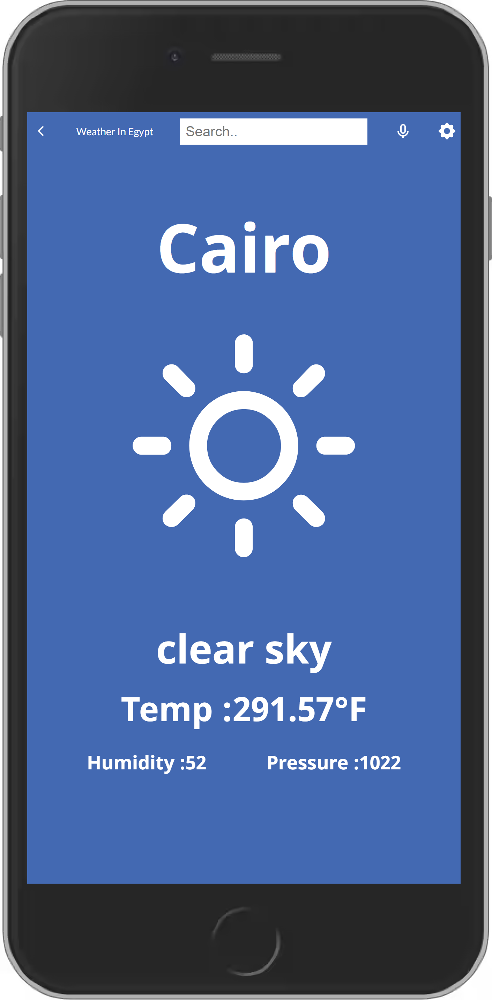

# REACT-REDUX-CAPSTONE

This React capstone project is about building a mobile web application to check a list of metrics (numeric values) that you will create making use of React and Redux.

We will select an API that provides numeric data about a topic that you like and then build the webapp around it. The webapp will have several pages.

## Screenshots

- Home Page

- Details Page



## Video

- [Link]()
- [Special feature]()

## Built With

- React-Redux
- CSS3

## Technologies used

- Github
- Gitflow
- Visual Studio Code

## Live Demo

- [netlify]()

## Getting Started

To clone this project :

- Run command: `git clone https://github.com/farouqdaif1/ract-redux-capstone.git`
- Or press the green Code button in the upper right corner and choose to download from the Download ZIP link.

### Setup

- Add linters from [linters-config](https://github.com/microverseinc/linters-config/tree/master/react-redux)
- Set up a new project Create React App (CRA)

- to create a React application is using Create React App (CRA) and following the instructions in this [guide](https://reactjs.org/docs/create-a-new-react-app.html#create-react-app)

```
npx create-react-app react-redux-capstone
cd react-redux-capstone
npm start
```

- Add React Redux

```
npm install react-redux
```

- Add React Router [React Router](https://v5.reactrouter.com/web/guides/quick-start)

👤 **Farouq Daif**

- GitHub: [@farouqdaif1](https://github.com/farouqdaif1)
- Twitter: [@farouqdaif](https://twitter.com/farouqdaif)
- LinkedIn: [LinkedIn](https://www.linkedin.com/in/farouqdaif/https://www.linkedin.com/in/farouqdaif/)

## 🤝 Contributing

Contributions, issues, and feature requests are welcome!

Feel free to check the [issues page](../../issues/).

## Show your support

Give a ⭐️ if you like this project!

## Acknowledgments

- [Nelson Sakwa on Behance](https://www.behance.net/sakwadesignstudio)

## 📝 License

This project is [MIT](./MIT.md) licensed.
